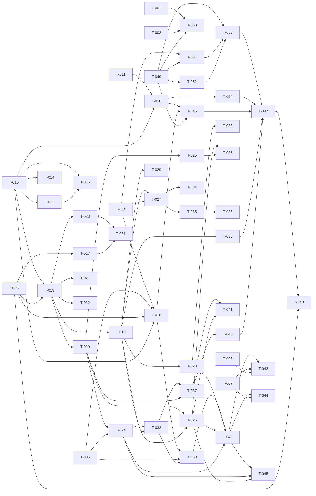

# Build Site

54 tasks across 9 tiers (0–8) from 11 kits. One task per requirement
(requirement-grained); `/ck:make` may sub-split a task whose acceptance criteria
warrant parallel work. Phase 1 (desktop x86_64 PoC) is everything except the
device track; Phase 2 (webOS ARMv7) is T-011, T-018, T-046, T-047, T-048, T-054,
which can begin in parallel where their blockers allow.

Two front-end variants ship as separate `.ipk`s: the Enyo-1.0 UI (`app/`,
cavekit-ui-shell) and the Enyo-2/Mochi UI (`app-mochi/`, cavekit-mochi-ui). Both
drive the same BrowserAdapter contract; both are packaged for the TouchPad and
the TouchPad Go.

Effort key: S = <½ day, M = ~1–2 days, L = multi-day / high-risk.

---

## Tier 0 — No Dependencies (Start Here)

| Task | Title | Cavekit | Req | Effort |
|------|-------|---------|-----|--------|
| T-001 | Top-level LICENSE + NOTICE + full license texts | cavekit-licensing-branding.md | R2 | S |
| T-002 | State Apache-2.0 + MPL-2.0 file-level compatibility in LICENSE | cavekit-licensing-branding.md | R5 | S |
| T-003 | License-header policy + header-verification scan | cavekit-licensing-branding.md | R1 | S |
| T-004 | Import & freeze YAP interface; byte-identical check vs upstream | cavekit-ipc-contract.md | R1 | M |
| T-005 | Import shared-mem framebuffer plumbing + offscreen-info pixel contract | cavekit-ipc-contract.md | R2 | M |
| T-006 | Import daemon lifecycle + page manager (engine-agnostic) | cavekit-ipc-contract.md | R3 | M |
| T-007 | Rebrand app package (id/title/vendor/icons/universalSearch) | cavekit-ui-shell.md | R1 | S |
| T-008 | Verify UI uses unchanged adapter contract (method set == upstream) | cavekit-ui-shell.md | R2 | S |
| T-009 | Preserve Apache headers on forked UI files | cavekit-ui-shell.md | R3 | S |
| T-010 | Engine build config: out-of-tree, embedding-capable, no front-end | cavekit-engine-embedding.md | R1 | L |
| T-011 | ARMv7 cross-toolchain bring-up + trivial on-device binary | cavekit-device-build.md | R1 | L |
| T-049 | Scaffold Enyo-2 + Mochi app shell (app-mochi: appinfo, entry, bundling) | cavekit-mochi-ui.md | R1 | M |

---

## Tier 1 — Depends on Tier 0

| Task | Title | Cavekit | Req | blockedBy | Effort |
|------|-------|---------|-----|-----------|--------|
| T-012 | No-vendor verification + gitignore + external engine reference | cavekit-engine-embedding.md | R4 | T-010 | S |
| T-013 | Embedding runtime init/shutdown + per-page instance lifecycle | cavekit-engine-embedding.md | R2 | T-010, T-006 | L |
| T-014 | Branding-strip engine config (Pale Moon/Basilisk removal) + artifact scan | cavekit-licensing-branding.md | R3 | T-010 | M |
| T-015 | MPL source-availability documentation | cavekit-licensing-branding.md | R4 | T-010, T-012 | S |
| T-016 | Desktop build wiring (daemon+backend link, Luna compiled out) | cavekit-desktop-build.md | R1 | T-010, T-004, T-005, T-006 | L |
| T-017 | LunaService clearCache/clearCookies registration + desktop compile-out | cavekit-ipc-contract.md | R4 | T-006 | M |
| T-018 | Cross-compile engine for webOS 3 ARMv7 | cavekit-device-build.md | R2 | T-011, T-010 | L |
| T-050 | Mochi variant licensing + attribution (Apache headers, NOTICE) | cavekit-mochi-ui.md | R5 | T-001, T-003, T-049 | S |
| T-051 | Enyo-2 WebView control bound to the unchanged BrowserAdapter | cavekit-mochi-ui.md | R3 | T-004, T-049 | L |
| T-052 | Mochi controls + layout for TouchPad / TouchPad Go | cavekit-mochi-ui.md | R4 | T-049 | M |

---

## Tier 2 — Depends on Tier 1

| Task | Title | Cavekit | Req | blockedBy | Effort |
|------|-------|---------|-----|-----------|--------|
| T-019 | Engine event-loop integration with daemon loop | cavekit-engine-embedding.md | R3 | T-013 | L |
| T-020 | Headless windowless render surface (offscreen widget) | cavekit-offscreen-rendering.md | R1 | T-013 | L |
| T-021 | setHtml inline content loading | cavekit-navigation-events.md | R2 | T-013 | S |
| T-022 | Keyboard input synthesis + insertStringAtCursor | cavekit-input-bridging.md | R2 | T-013 | M |
| T-023 | Engine settings (UA, JS, minFont, blockPopups, acceptCookies) | cavekit-browser-services.md | R1 | T-013 | M |
| T-046 | OE recipes + two UI .ipks (Enyo + Mochi) + daemon + adapter | cavekit-device-build.md | R3 | T-018, T-016, T-049 | L |
| T-053 | Mochi UI feature-parity port (views + dialogs, Mochi controls) | cavekit-mochi-ui.md | R2 | T-049, T-051, T-052 | L |
| T-054 | TouchPad Go (Opal) machine config; build both models | cavekit-device-build.md | R6 | T-018 | M |

---

## Tier 3 — Depends on Tier 2

| Task | Title | Cavekit | Req | blockedBy | Effort |
|------|-------|---------|-----|-----------|--------|
| T-024 | Frame readback into shared buffer (format/orientation) + renderToFile | cavekit-offscreen-rendering.md | R2 | T-020, T-005 | L |
| T-025 | Geometry/viewport events (contents-size, scrolled-to, meta-viewport) | cavekit-offscreen-rendering.md | R4 | T-020 | M |
| T-026 | Pointer click/hold synthesis | cavekit-input-bridging.md | R1 | T-020, T-019 | M |
| T-027 | Navigation commands + canGoBack/Forward state | cavekit-navigation-events.md | R1 | T-019, T-004 | M |
| T-028 | Load lifecycle events in correct order | cavekit-navigation-events.md | R3 | T-019 | M |
| T-029 | JS dialogs with blocking sync-pipe semantics | cavekit-browser-services.md | R3 | T-019 | M |
| T-030 | TLS/cert confirm flow (desktop) | cavekit-browser-services.md | R5 | T-019 | M |
| T-031 | Cache & cookie management + Luna actions | cavekit-browser-services.md | R2 | T-023, T-017 | M |

---

## Tier 4 — Depends on Tier 3

| Task | Title | Cavekit | Req | blockedBy | Effort |
|------|-------|---------|-----|-----------|--------|
| T-032 | Paint notification protocol (msgPainted, double-buffer, coalesce) | cavekit-offscreen-rendering.md | R3 | T-024, T-019 | L |
| T-033 | Location/title/redirect events | cavekit-navigation-events.md | R4 | T-028 | M |
| T-034 | History-state query/response | cavekit-navigation-events.md | R5 | T-027 | S |
| T-035 | Global history + link-click + url-redirect rules | cavekit-navigation-events.md | R6 | T-027 | M |
| T-036 | Drag/flick scrolling | cavekit-input-bridging.md | R4 | T-026, T-025 | M |

---

## Tier 5 — Depends on Tier 4

| Task | Title | Cavekit | Req | blockedBy | Effort |
|------|-------|---------|-----|-----------|--------|
| T-037 | Resize/zoom/scroll commands affect rendered output | cavekit-offscreen-rendering.md | R5 | T-032, T-020 | M |
| T-038 | Downloads + MIME handoff + cancel | cavekit-browser-services.md | R4 | T-035 | M |
| T-039 | Minimal YAP test client (connect/shm/openUrl/recv paint/write image) | cavekit-desktop-build.md | R2 | T-016, T-005, T-032 | M |

---

## Tier 6 — Depends on Tier 5

| Task | Title | Cavekit | Req | blockedBy | Effort |
|------|-------|---------|-----|-----------|--------|
| T-040 | Touch/gesture synthesis (pinch→zoom, tap→click) | cavekit-input-bridging.md | R3 | T-037 | M |
| T-041 | Coordinate mapping under zoom/scroll | cavekit-input-bridging.md | R5 | T-037, T-026 | M |
| T-042 | Phase-1 acceptance: end-to-end render (local+http, lifecycle, click-follows-link) | cavekit-desktop-build.md | R3 | T-039, T-028, T-026, T-024 | M |

---

## Tier 7 — Depends on Tier 6

| Task | Title | Cavekit | Req | blockedBy | Effort |
|------|-------|---------|-----|-----------|--------|
| T-043 | UI drives new daemon unchanged (start page, address bar, controls, find) | cavekit-ui-shell.md | R4 | T-042, T-007, T-008 | M |
| T-044 | (Optional) isis UI against desktop daemon | cavekit-desktop-build.md | R4 | T-042, T-007 | M |
| T-045 | BrowserAdapter-unchanged end-to-end verification | cavekit-ipc-contract.md | R5 | T-042, T-024, T-026 | M |
| T-047 | On-device run — both UIs on TouchPad + TouchPad Go (launch/render/nav/input/cert/dialog/download) | cavekit-device-build.md | R4 | T-046, T-030, T-040, T-053, T-054 | L |

---

## Tier 8 — Depends on Tier 7

| Task | Title | Cavekit | Req | blockedBy | Effort |
|------|-------|---------|-----|-----------|--------|
| T-048 | Memory budget fit + freeze/purge reclaim on device | cavekit-device-build.md | R5 | T-047, T-006 | M |

---

## Tier 9 — Independence + citizen rework (added 2026-07-31, user decision)

Supersedes the shared-runtime/refcount design. All of these are prerequisites for honestly
closing device-build R3/R4. T-055..T-058 touch disjoint surfaces and run in parallel.

| Task | Title | Cavekit | Req | blockedBy | Effort |
|------|-------|---------|-----|-----------|--------|
| T-055 | Per-variant adapter identity — shim MIME/name/impl path + impl YAP name, built ×3 | cavekit-device-build.md | R7 | — | M |
| T-056 | Packaging rework — run in place from cryptofs deviceroot, zero `/media/internal` writes, per-variant upstart job, exact-reverse prerm (direct-build `packaging/` + OE `jihad-app.inc`/`jihad-deviceroot`) | cavekit-device-build.md | R8 | — | L |
| T-057 | Daemon runtime paths off user storage — log/profile/cache/debug channels under a root-owned variant-scoped path, derived from `JIHAD_BS_NAME` | cavekit-device-build.md | R8 | — | M |
| T-058 | Per-variant WebView MIME routing in all three front-ends | cavekit-device-build.md | R7 | — | S |
| T-059 | Mojo front-end — working browser (render surface, address bar, back/fwd/reload/stop, progress, title, error) | cavekit-mojo-ui.md | R2, R3, R4 | T-058 | L |
| T-060 | Mojo package licensing/attribution (Apache headers + composite LICENSE/NOTICE) | cavekit-mojo-ui.md | R5 | T-059 | S |
| T-061 | On-device verification of independence + footprint: three-way install/remove matrix, stock-file checksum diff, filesystem residue diff | cavekit-device-build.md | R7, R8 | T-055, T-056, T-057, T-058, T-059 | L |

---

## Tier 10 — Add-ons & extensions (added 2026-08-01, user requirement)

T-062 is the P0 crash fix and the feature prerequisite in one: the daemon SIGSEGVs in
`XRE_NotifyProfile()` → `DoStartup()` precisely because no `nsIXULAppInfo` is registered, which is
the same thing the add-on manager needs. Everything else is gated behind it.

| Task | Title | Cavekit | Req | blockedBy | Effort |
|------|-------|---------|-----|-----------|--------|
| T-062 | Register `nsIXULAppInfo`/`nsIXULRuntime` in the embedded runtime (fixes the device SIGSEGV; stable app ID shared with the UA string) | cavekit-addons-extensions.md | R1 | — | M |
| T-063 | `about:addons` opens, lists, and is operable through the synthesized input path (incl. the XUL input hazard) | cavekit-addons-extensions.md | R2 | T-062 | L |
| T-064 | XPI install flow: prompt, accept/decline, target-application compatibility rejection | cavekit-addons-extensions.md | R3 | T-062, T-063 | L |
| T-065 | Prove an installed extension actually alters browsing; enable/disable toggles the effect | cavekit-addons-extensions.md | R4 | T-064 | M |
| T-066 | Extension persistence + per-variant isolation in `$APP/profile/extensions`; removal takes them with it | cavekit-addons-extensions.md | R5, R6 | T-064 | M |

---

## Tier 11 — XUL/chrome input (added 2026-08-01, user requirement)

"fix xul input so it works everywhere like about:config etc". Today synthesized input on XUL
SIGSEGVs the daemon and is skipped as a crash-avoidance measure, leaving `about:config` and
`about:addons` rendered but inert. T-067 is the blocker for cavekit-addons-extensions R2.

| Task | Title | Cavekit | Req | blockedBy | Effort |
|------|-------|---------|-----|-----------|--------|
| T-067 | Root-cause the XUL `SendMouseEvent` SIGSEGV (which widget/frame path derefs what `PuppetWidget` leaves null) | cavekit-input-bridging.md | R6 | — | L |
| T-068 | Make XUL accept mouse input for real; remove the `isXul` skip; XUL default actions run | cavekit-input-bridging.md | R6 | T-067 | L |
| T-069 | Keyboard input into XUL documents (e.g. `about:config`'s filter box) | cavekit-input-bridging.md | R6 | T-068 | M |
| T-070 | Acceptance: `about:config` fully operable (warning button, filter, select, change a pref) + no HTML input regression | cavekit-input-bridging.md | R6 | T-068, T-069 | M |

---

## Summary

| Tier | Tasks | Effort breakdown |
|------|-------|------------------|
| 0 | 12 | 6S, 3M, 3L |
| 1 | 10 | 2S, 3M, 5L |
| 2 | 8 | 1S, 3M, 4L |
| 3 | 8 | 6M, 2L |
| 4 | 5 | 1S, 3M, 1L |
| 5 | 3 | 3M |
| 6 | 3 | 3M |
| 7 | 4 | 3M, 1L |
| 8 | 1 | 1M |
| 9 | 7 | 2S, 2M, 3L |
| 10 | 5 | 3M, 2L |
| 11 | 4 | 2M, 2L |

**Total: 70 tasks, 12 tiers.** Tier 0 has 12 tasks runnable in parallel immediately.
The Mochi UI track (T-049/T-050/T-051/T-052/T-053) is parallelizable with the
engine work; T-054 + T-046 produce the two `.ipk`s for both TouchPad models.

## Coverage Matrix

Every acceptance criterion maps to its requirement's task. (Criterion text abbreviated.)

| Cavekit | Req | Criterion | Task | Status |
|---------|-----|-----------|------|--------|
| ui-shell | R1 | Jihad app id/title/vendor | T-007 | COVERED |
| ui-shell | R1 | no stock com.palm.app.browser ref | T-007 | COVERED |
| ui-shell | R1 | icons load | T-007 | COVERED |
| ui-shell | R1 | universalSearch uses new id | T-007 | COVERED |
| ui-shell | R2 | callBrowserAdapter set == upstream | T-008 | COVERED |
| ui-shell | R2 | PalmServiceBridge URIs == upstream | T-008 | COVERED |
| ui-shell | R2 | no Goanna/UXP ids in app/ | T-008 | COVERED |
| ui-shell | R3 | forked files keep Apache header | T-009 | COVERED |
| ui-shell | R3 | new UI files carry Apache header | T-009 | COVERED |
| ui-shell | R4 | launches to start page | T-043 | COVERED |
| ui-shell | R4 | address bar → openUrl | T-043 | COVERED |
| ui-shell | R4 | back/fwd/reload/stop calls | T-043 | COVERED |
| ui-shell | R4 | find issues findInPage | T-043 | COVERED |
| mochi-ui | R1 | distinct id/title (.mochi) | T-049 | COVERED |
| mochi-ui | R1 | coexists with Enyo variant | T-049 | COVERED |
| mochi-ui | R1 | uses Jihad icon set | T-049 | COVERED |
| mochi-ui | R2 | address/search bar + nav | T-053 | COVERED |
| mochi-ui | R2 | bookmarks/history/downloads views | T-053 | COVERED |
| mochi-ui | R2 | find/preferences/start page | T-053 | COVERED |
| mochi-ui | R2 | alert/confirm/prompt/auth/SSL dialogs | T-053 | COVERED |
| mochi-ui | R2 | parity checklist vs app/ [human-review] | T-053 | COVERED |
| mochi-ui | R3 | Enyo-2 WebView bound to BrowserAdapter | T-051 | COVERED |
| mochi-ui | R3 | method set + Luna URIs == Enyo variant | T-051 | COVERED |
| mochi-ui | R3 | no Goanna/UXP ids in app-mochi/ | T-051 | COVERED |
| mochi-ui | R4 | composed from Mochi controls | T-052 | COVERED |
| mochi-ui | R4 | layout usable on TouchPad + Go [human-review] | T-052 | COVERED |
| mochi-ui | R4 | Enyo2+layout+Mochi bundled (not vendored) | T-052 | COVERED |
| mochi-ui | R5 | app-mochi files carry Apache header | T-050 | COVERED |
| mochi-ui | R5 | Mochi/Enyo2 attributed in NOTICE | T-050 | COVERED |
| ipc-contract | R1 | YAP commands/messages unchanged | T-004 | COVERED |
| ipc-contract | R1 | nothing added/removed/renamed | T-004 | COVERED |
| ipc-contract | R1 | regenerated from .yap not hand-edited | T-004 | COVERED |
| ipc-contract | R2 | connect/thaw attach 2 segments | T-005 | COVERED |
| ipc-contract | R2 | one paint-ready per frame naming buffer | T-005 | COVERED |
| ipc-contract | R2 | no reuse before return | T-005 | COVERED |
| ipc-contract | R2 | format/stride/size match upstream | T-005 | COVERED |
| ipc-contract | R3 | start/connect/create page per id | T-006 | COVERED |
| ipc-contract | R3 | freeze/thaw/purge as upstream | T-006 | COVERED |
| ipc-contract | R3 | exit after last client | T-006 | COVERED |
| ipc-contract | R3 | multiple pages independent | T-006 | COVERED |
| ipc-contract | R4 | clearCache/clearCookies registered (device) | T-017 | COVERED |
| ipc-contract | R4 | service compiled out on desktop | T-017 | COVERED |
| ipc-contract | R5 | upstream adapter rebuilt drives daemon | T-045 | COVERED |
| ipc-contract | R5 | no adapter source change | T-045 | COVERED |
| engine-embedding | R1 | builds w/o Pale Moon front-end | T-010 | COVERED |
| engine-embedding | R1 | outputs lib + headers | T-010 | COVERED |
| engine-embedding | R1 | reproducible from documented host | T-010 | COVERED |
| engine-embedding | R2 | runtime init/shutdown clean | T-013 | COVERED |
| engine-embedding | R2 | profile/data dir established | T-013 | COVERED |
| engine-embedding | R2 | instance create/destroy no leak | T-013 | COVERED |
| engine-embedding | R3 | loads progress, daemon responsive | T-019 | COVERED |
| engine-embedding | R3 | no busy-wait, idle when no work | T-019 | COVERED |
| engine-embedding | R3 | timers/async fire on schedule | T-019 | COVERED |
| engine-embedding | R4 | no UXP source copy in repo | T-012 | COVERED |
| engine-embedding | R4 | build references external source | T-012 | COVERED |
| engine-embedding | R4 | obj dirs git-ignored | T-012 | COVERED |
| offscreen | R1 | render w/o native window | T-020 | COVERED |
| offscreen | R1 | surface size tracks page/window | T-020 | COVERED |
| offscreen | R2 | non-blank correct-size image | T-024 | COVERED |
| offscreen | R2 | format/stride match (renderToFile/checksum) | T-024 | COVERED |
| offscreen | R2 | no channel swap / no flip | T-024 | COVERED |
| offscreen | R3 | one paint-ready per frame | T-032 | COVERED |
| offscreen | R3 | no reuse before return | T-032 | COVERED |
| offscreen | R3 | invalidations coalesced | T-032 | COVERED |
| offscreen | R4 | contents-size-changed emitted | T-025 | COVERED |
| offscreen | R4 | scrolled-to emitted | T-025 | COVERED |
| offscreen | R4 | meta-viewport emitted w/ values | T-025 | COVERED |
| offscreen | R5 | setWindowSize/setVirtualWindowSize | T-037 | COVERED |
| offscreen | R5 | setScrollPosition/scrollLayer move content | T-037 | COVERED |
| offscreen | R5 | setZoomAndScroll changes scale/pos | T-037 | COVERED |
| input | R1 | clickAt hits element at point | T-026 | COVERED |
| input | R1 | click count preserved | T-026 | COVERED |
| input | R1 | holdAt long-press | T-026 | COVERED |
| input | R2 | keyDown/Up correct key+mods | T-022 | COVERED |
| input | R2 | typing inserts characters | T-022 | COVERED |
| input | R2 | insertStringAtCursor at caret | T-022 | COVERED |
| input | R3 | touchEvent → DOM touch points | T-040 | COVERED |
| input | R3 | pinch→zoom, tap→click | T-040 | COVERED |
| input | R3 | multi-touch count/coords preserved | T-040 | COVERED |
| input | R4 | drag scrolls page + overflow | T-036 | COVERED |
| input | R4 | scroll emits scrolled-to consistent | T-036 | COVERED |
| input | R5 | zoomed+scrolled click hits shown element | T-041 | COVERED |
| input | R5 | mapping consistent w/ reported geometry | T-041 | COVERED |
| navigation | R1 | openUrl loads | T-027 | COVERED |
| navigation | R1 | back/fwd/reload/stop | T-027 | COVERED |
| navigation | R1 | canGoBack/Forward accurate | T-027 | COVERED |
| navigation | R1 | clearHistory empties | T-027 | COVERED |
| navigation | R2 | setHtml renders body at base URL | T-021 | COVERED |
| navigation | R3 | started→progress 0..100→stopped/finished | T-028 | COVERED |
| navigation | R3 | failed-load/main-doc-error on failure | T-028 | COVERED |
| navigation | R3 | stop mid-load ends cleanly | T-028 | COVERED |
| navigation | R4 | location-changed w/ url+nav state | T-033 | COVERED |
| navigation | R4 | title-changed (+combined) | T-033 | COVERED |
| navigation | R4 | url-redirected on redirect | T-033 | COVERED |
| navigation | R5 | history-state response w/ queryNum | T-034 | COVERED |
| navigation | R6 | update-global-history on nav | T-035 | COVERED |
| navigation | R6 | link-clicked for intercepted links | T-035 | COVERED |
| navigation | R6 | addUrlRedirect rules honored | T-035 | COVERED |
| browser-services | R1 | setUserAgent changes UA | T-023 | COVERED |
| browser-services | R1 | setEnableJavaScript toggles JS | T-023 | COVERED |
| browser-services | R1 | setMinFontSize enforced | T-023 | COVERED |
| browser-services | R1 | blockPopups/acceptCookies take effect | T-023 | COVERED |
| browser-services | R2 | clearCache empties cache | T-031 | COVERED |
| browser-services | R2 | clearCookies removes cookies | T-031 | COVERED |
| browser-services | R2 | acceptCookies=false blocks set-cookie | T-031 | COVERED |
| browser-services | R2 | reachable via Luna on device | T-031 | COVERED |
| browser-services | R3 | dialogs emit msg w/ sync path | T-029 | COVERED |
| browser-services | R3 | page blocks then resumes w/ reply | T-029 | COVERED |
| browser-services | R4 | start/progress/finished w/ path+mime | T-038 | COVERED |
| browser-services | R4 | cancelDownload aborts | T-038 | COVERED |
| browser-services | R4 | unsupported MIME → handoff/not-supported | T-038 | COVERED |
| browser-services | R5 | invalid cert → SSL-confirm w/ host/code/cert | T-030 | COVERED |
| browser-services | R5 | accept proceeds, reject aborts | T-030 | COVERED |
| browser-services | R5 | device cert-store integration [human-review] | T-047 | COVERED |
| desktop-build | R1 | single-entry build → runnable daemon | T-016 | COVERED |
| desktop-build | R1 | links IPC layer + Goanna backend | T-016 | COVERED |
| desktop-build | R1 | Luna compiled out for desktop | T-016 | COVERED |
| desktop-build | R2 | client connects/allocs shm/openUrl | T-039 | COVERED |
| desktop-build | R2 | receives paint + writes image | T-039 | COVERED |
| desktop-build | R2 | returns buffers, rendering continues | T-039 | COVERED |
| desktop-build | R3 | local+http page render correct | T-042 | COVERED |
| desktop-build | R3 | lifecycle messages in order | T-042 | COVERED |
| desktop-build | R3 | click follows link changes page | T-042 | COVERED |
| desktop-build | R4 | documented path drives from UI | T-044 | COVERED |
| desktop-build | R4 | fallback to harness if no Enyo [human-review] | T-044 | COVERED |
| device-build | R1 | reproducible modern cross-toolchain | T-011 | COVERED |
| device-build | R1 | trivial C++14 binary runs on device | T-011 | COVERED |
| device-build | R1 | matches device sysroot (no newer glibc) | T-011 | COVERED |
| device-build | R2 | engine builds w/ cross-toolchain | T-018 | COVERED |
| device-build | R2 | libs load on device (no missing sym/ABI) | T-018 | COVERED |
| device-build | R2 | ARMv7 FP/SIMD flags match CPU | T-018 | COVERED |
| device-build | R3 | daemon + adapter built once (shared) | T-046 | COVERED |
| device-build | R3 | two UI .ipks (Enyo + Mochi) produced | T-046 | COVERED |
| device-build | R3 | both UI packages install + coexist | T-046 | COVERED |
| device-build | R3 | Mochi bundles Enyo2; Enyo bundles Enyo1 | T-046 | COVERED |
| device-build | R4 | each UI launches + page on-screen (Topaz) | T-047 | COVERED |
| device-build | R4 | nav/scroll/tap work | T-047 | COVERED |
| device-build | R4 | cert/dialog/download w/ device services | T-047 | COVERED |
| device-build | R4 | same verified on TouchPad Go (Opal) | T-047 | COVERED |
| device-build | R7 | distinct MIME/shim/impl/YAP name/socket/upstart per variant | T-055 | COVERED |
| device-build | R7 | each front-end routes only its own MIME | T-058 | COVERED |
| device-build | R7 | installing B never overwrites A's files | T-056 | COVERED |
| device-build | R7 | removing one leaves the others working, no refcount | T-056, T-061 | COVERED |
| device-build | R7 | own daemon+socket per variant; crash isolation | T-057, T-061 | COVERED |
| device-build | R8 | zero writes to /media/internal; engine runs in place | T-056, T-057 | COVERED |
| device-build | R8 | no stock file modified (checksum diff) | T-061 | COVERED |
| device-build | R8 | rootfs footprint namespaced + enumerated in docs | T-056 | COVERED |
| device-build | R8 | writable state root-owned, variant-scoped, removed | T-057 | COVERED |
| device-build | R8 | prerm removes exactly its own files (residue diff) | T-056, T-061 | COVERED |
| device-build | R8 | rootfs rw window closed on every exit path | T-056 | COVERED |
| mojo-ui | R1 | distinct app id + Jihad icons | T-058 | COVERED |
| mojo-ui | R1 | installs alongside both other variants | T-061 | COVERED |
| mojo-ui | R1 | removing it leaves the others working | T-061 | COVERED |
| mojo-ui | R2 | render surface bound to its MIME shows a page | T-059 | COVERED |
| mojo-ui | R2 | address entry navigates | T-059 | COVERED |
| mojo-ui | R2 | back/forward/reload/stop drive the adapter | T-059 | COVERED |
| mojo-ui | R2 | load state visible (progress + stop/reload) | T-059 | COVERED |
| mojo-ui | R2 | title + committed URL reflected | T-059 | COVERED |
| mojo-ui | R2 | failed load surfaces an error | T-059 | COVERED |
| mojo-ui | R3 | callBrowserAdapter set ⊆ Enyo's, no renames | T-059 | COVERED |
| mojo-ui | R3 | only its own MIME, never another's | T-058 | COVERED |
| mojo-ui | R3 | no Goanna/UXP identifiers in app-mojo/ | T-059 | COVERED |
| mojo-ui | R4 | real Mojo idiom (stage/scene assistants, sources.json) | T-059 | COVERED |
| mojo-ui | R4 | uses system Mojo framework, not bundled | T-059 | COVERED |
| mojo-ui | R4 | layout usable on Topaz + Opal [human-review] | T-061 | COVERED |
| mojo-ui | R5 | Apache headers on app-mojo sources | T-060 | COVERED |
| mojo-ui | R5 | ships composite LICENSE + NOTICE | T-060 | COVERED |
| addons | R1 | nsIXULAppInfo registered before NotifyProfile | T-062 | COVERED |
| addons | R1 | nsIXULRuntime members answered | T-062 | COVERED |
| addons | R1 | stable documented application ID | T-062 | COVERED |
| addons | R1 | identity shared with the UA string, one source | T-062 | COVERED |
| addons | R1 | no stripped branding reintroduced | T-062 | COVERED |
| addons | R1 | device SIGSEGV gone with NotifyProfile ENABLED | T-062 | COVERED |
| addons | R2 | about:addons renders the manager | T-063 | COVERED |
| addons | R2 | lists add-ons with name/version/state | T-063 | COVERED |
| addons | R2 | enable/disable/remove persist across restart | T-063 | COVERED |
| addons | R2 | operable via synthesized input (XUL hazard) | T-063 | COVERED |
| addons | R3 | .xpi triggers install, not download | T-064 | COVERED |
| addons | R3 | prompt identifies add-on; decline installs nothing | T-064 | COVERED |
| addons | R3 | accepted add-on appears + is active | T-064 | COVERED |
| addons | R3 | targetApplication mismatch rejected with a reason | T-064 | COVERED |
| addons | R4 | a test extension observably alters a real page | T-065 | COVERED |
| addons | R4 | disable stops the effect; re-enable restores | T-065 | COVERED |
| addons | R5 | extensions survive daemon restart + reboot | T-066 | COVERED |
| addons | R5 | per-variant profile isolation of extensions | T-066 | COVERED |
| addons | R5 | removing a variant removes only its extensions | T-066 | COVERED |
| addons | R6 | extension data on cryptofs, not /media/internal or /var | T-066 | COVERED |
| addons | R6 | install/removal writes nothing outside the profile | T-066 | COVERED |
| device-build | R6 | machine configs for Topaz + Opal | T-054 | COVERED |
| device-build | R6 | daemon/adapter/both .ipks build+install both models | T-054 | COVERED |
| device-build | R6 | model-specific diffs captured | T-054 | COVERED |
| device-build | R5 | render RSS within budget | T-048 | COVERED |
| device-build | R5 | freeze/purge reclaim | T-048 | COVERED |
| device-build | R5 | no OOM during scenario | T-048 | COVERED |
| licensing | R1 | Apache files keep headers | T-003 | COVERED |
| licensing | R1 | new backend files MPL header | T-003 | COVERED |
| licensing | R1 | no header removed/altered | T-003 | COVERED |
| licensing | R2 | LICENSE enumerates components | T-001 | COVERED |
| licensing | R2 | NOTICE attributes HP/LG/Mozilla | T-001 | COVERED |
| licensing | R2 | full license texts under licenses/ | T-001 | COVERED |
| licensing | R3 | engine config strips branding | T-014 | COVERED |
| licensing | R3 | artifacts show only Jihad name | T-014 | COVERED |
| licensing | R3 | scan finds no Pale Moon/Basilisk | T-014 | COVERED |
| licensing | R4 | MPL mods stay MPL, source available | T-015 | COVERED |
| licensing | R4 | engine origin + patches documented | T-015 | COVERED |
| licensing | R5 | LICENSE explains Apache+MPL combo | T-002 | COVERED |

**Coverage: 157/157 criteria (100%).**

## Dependency Graph

