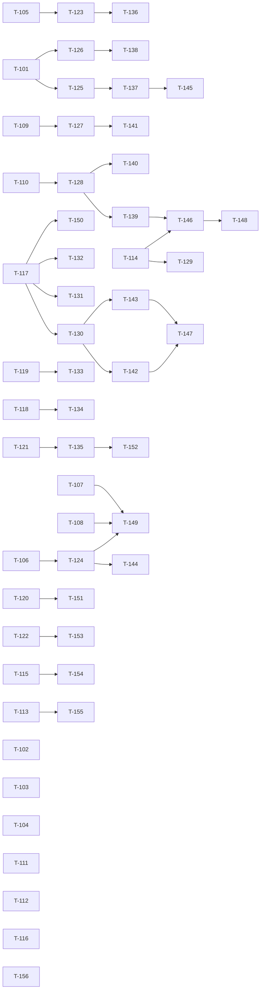

# Build Site

56 tasks across 6 tiers (Tier 0-4 plus one final BLOCKED-EXTERNAL tier), covering exactly the 41 acceptance criteria that are still `[~]` or `[ ]` across `context/kits/` as of 2026-08-10 — nothing else. The other 327 criteria are already `[x]` and are recorded as met in the kits themselves; they are not restated here, and no task in this site re-verifies one except where a still-open criterion depends on it (T-117 re-checks that `about:preferences` still loads on the binaries actually on the device, because every prefs criterion is measured through that page and the device was re-flashed with patches 0027/0028/0029 after the 2026-08-05/06 prefs verifications). Eight tasks are blocked on hardware that does not exist here (no keyboard, no TouchPad Go), on a human at the device (a real tap, a real pinch, an untrusted-cert/download session), on an interactive sudo password, or on a human sign-off/decision — those are quarantined in the final tier so they never sit in front of schedulable work. Two ordering facts drive the graph: the codec verdict (T-101) is upstream of the entire `<video>` chain and is cheap because half the answer is already in `mozconfig.goanna-arm`; and the third plugin-draw driver must be COUNTED (T-105) before any further pacing conclusion is trustworthy — three sessions of frame-rate conclusions have been drawn without that number.

## Tier 0 — No Dependencies (Start Here)

| Task | Title | Cavekit | Requirement | Effort |
|------|-------|---------|-------------|--------|
| T-101 | ✅ **DONE 2026-08-10 — criterion closed to `[x]`.** Device-measured on a clean restart: **WebM/VP8 PLAYS** (`readyState=4`, 160x120, `currentTime` advancing), **H.264/MP4 not supported**, **MP3 refused outright** (`canPlayType` empty, `error.code=4` SRC_NOT_SUPPORTED). Note the prediction this task was written from — "decodes into silence" — was WRONG; with no cubeb backend the engine does not offer the type at all. Build-side evidence: decoders present (`MOZ_FFVPX`/`MOZ_FFMPEG`/`MOZ_FMP4`, 110 objects under `media/ffvpx`, linked into `libxul.so`), audio output absent — the proof is the objdir rather than the flags, `media/libcubeb/src/` compiled only `cubeb.o` and `cubeb_panner.o`, **no backend**. Does NOT contradict "Flash produces sound": Flash `dlopen`s ALSA itself and never touches the engine's audio path | cavekit-gre-widgets.md | R1 | M |
| T-102 | ✅ **DONE 2026-08-10 — criterion closed `[x]` by the "justify in writing" option.** The path is already bounded by construction, not by a pixel test: the damage box is clamped into the visible band on all four sides (`BrowserPageGoanna.cpp:2184-2190`), the branch only runs on an exact buffer-state match incl. scrollX/scrollY (`:2175-2179`), `RenderRegion`'s bool covers "did not run", and — decisively — a partial paint only ever rewrites a sub-rect of a frame that already passed the FULL path's blank check, so it cannot produce a blank card frame. A per-rect blankness test was considered and REJECTED: an all-white damage rect is ordinary (caret blink, erased text), so the full path's `>240` test would suppress correct frames | cavekit-offscreen-rendering.md | R8 | S |
| T-103 | **DESKTOP HALF VERIFIED 2026-08-15 (`xpi_mismatch_test.cpp`): the observer FIRES — refusal produces `DIALOG ALERT [Jihad T103 Mismatch could not be installed because it is not compatible with Jihad Browser 1.0.]`, 0 confirms, -210 to page unchanged, nothing installed; matching-declined control shows the CONFIRM and ZERO alerts, proving the `appDisabled` filter discriminates. Criterion stays `[~]` on the device screenshot only.** Earlier state: **PARTIAL 2026-08-10, host-only, NOT built and NOT run.** The premise has a null answer: there is no incompatibility enum in this UXP at all (`AddonManager.jsm:2563-2574` has only -1/-2/-3/-4/-8/-9; `install.error` is 0 for an appDisabled add-on). And `-210` is unreachable from anything we own: `amWebInstallListener.js:147` cancels the appDisabled install BEFORE notifying `addon-install-failed` at `:150`, and `cancel()` synchronously drives `addonManager.js:110-113` to `USER_CANCELLED`. Changing the int needs a new UXP patch on `addonManager.js`. Landed the half we do own, and it is the half upstream Firefox actually uses: `jihadInstallPrompt.js` observes `addon-install-failed` and alerts the card with an incompatibility-specific message through the existing prompter override; `DialogService.cpp` instantiates it at startup so the observer exists before the refusal | cavekit-addons-extensions.md | R3 | S |
| T-104 | ✅ **DONE (host-complete) 2026-08-10 (kit; site row reconciled 2026-08-15).** Enumeration recorded on device-build R9's last criterion, measured under qemu-arm with both in-tree toolchains: `sem_t` numbers host-reproduced both directions (pre-2.21 reads 2.23's bytes as 2x over-count); `ProcessMutex` layouts IDENTICAL but `__kind` MEANING differs (2.5 writes 0 + EINVALs on 128) — armed, worse than worded. Criterion stays `[~]` only for the device-library closure (not in this repo) — the named device items | cavekit-device-build.md | R9 | M |
| T-105 | ✅ **DONE 2026-08-10** — counted. Every `AsyncShowPluginFrame` call site is tagged and reported as `show req:` next to `palm draw`. **The suspect named here was WRONG: all background paths measured exactly ZERO.** Two real findings instead — (a) the host-drive lease was shorter than the daemon's re-ask timeout, so it flapped and the child's timer restarted; fixed, and the clock log now shows one `-> HOST` and no fallback. (b) `gJihadNPNInvalidateRectCalls`, the counter patch `0026` relies on to decide the plugin never self-invalidates, is **structurally blind** — it only catches calls that bind the `NPN_InvalidateRect` symbol, while an ordinary plugin goes through the NPAPI funcs table into `PluginModuleChild::_invalidaterect` (`:986`, `:1302-1310`), which never touches the interpose. 1344 host requests against 2662 invalidates with the timer off | cavekit-addons-extensions.md | R7 | M |
| T-106 | ✅ **DONE 2026-08-10 (recorded in kit; site row reconciled 2026-08-15).** Resolved by PROVENANCE: device adapter md5 `0410a348042af58a7e711b495db69833` matches the PDK build of the tree containing the gate (`BrowserAdapter.cpp:1404,1465,1507`). The `strings`-grep test returned 0 and is INVALID (private member, no format strings) — recorded on the criterion so nobody repeats it. Runtime value of `mFlashGestureLock` is T-124 | cavekit-input-bridging.md | R7 | S |
| T-107 | ✅ **DONE 2026-08-15.** Observable + procedure rebuilt (addons R7 criterion, 2026-08-15 annotation; stage-test-pages.sh keyarb page: `JIHAD-KEYARB` wrong-card banner, `#kc` per-run key counter, `#fo` activeElement confound control, `#sy` repurposed as pan instrument). THREE source findings en route: SWF green→red fires in BOTH pass and leak (`asyncCmdKeyDown` unconditional at :1613 — SWF is a delivery control, not the arbitration answer); the latch-setting double-tap also smart-zooms, so baseline screenshot AFTER the double-tap; ESC exempt at :1614 — never test with Escape. Latch finding rescoped T-124/T-144 (double-tap-only). Device run itself is T-149 (BLOCKED-EXTERNAL) | cavekit-addons-extensions.md | R7 | S |
| T-108 | Find what `hidd` requires before it forwards a device: `/etc/hidd/HidPlugins.xml` → HidInputDev, `/usr/lib/libhidinputdev.so`, `/var/run/hidd/InputDevEventSocket` (uinput event3 is opened by hidd and LunaSysMgr but never dispatched) | cavekit-input-bridging.md | R7 | M |
| T-109 | ✅ **ANSWERED 2026-08-10 (kit; site row reconciled 2026-08-15) — the answer is NO, and the handover must NOT be written before a T-141 device pass.** Seven findings on the criterion (gre-widgets R3): TWO gates not one (`GoannaRenderPage::KeyEvent:3006` early-returns on the same condition — deleting only `keyDown`'s makes fields DEAD); the 102 handlers contain no Backspace/Enter/Tab/insertion; the keycode namespaces are disjoint (VK_LEFT=37 vs 0xE0A2) so the reachable XBL subset is EMPTY; Ctrl/Alt modifier bits are SWAPPED; `sendKeyEvent` cannot express Enter-as-line-break (needs UXP patch); held-Backspace acceleration + the deferred-Enter device-SAFETY rule (F-219) would be lost; no safe partial subset (mixed undo model). Criterion stays `[ ]` pending T-141 device measurements (i)-(iv) listed in the kit | cavekit-gre-widgets.md | R3 | M |
| T-110 | ✅ **DONE 2026-08-10 (kit; site row reconciled 2026-08-15).** Audit recorded in impl-gre-widget-inventory.md (+389 lines): four authored rows (about:preferences/settings = chrome-privileged HTML w/ native controls; about:jihad/isis inline HTML; XPI confirm routes to card; chrome://branding data files). R4 first criterion stays `[~]` only for the standing rule; R4's richlistbox/tree criterion CLOSED by T-140 decision | cavekit-gre-widgets.md | R4 | S |
| T-111 | **PARTIAL 2026-08-10 (kit; site row reconciled 2026-08-15).** Split DONE in source: all ELEVEN row-backing prefs moved to `packaging/prefs/jihad-platform-prefs.js`; 16 device-only prefs stay inline DELIBERATELY (512 MB/ARM numbers, rule written into both files). Stays open: (1) one desktop-harness run of about:preferences to observe the rows (argument→observation), (2) `build-goanna.sh`'s two pref appends are `[ -f ]`-guarded with a SILENT skip — harden to fail loud like the prefs-ui block. **BOTH DONE 2026-08-15 — criterion `[x]`:** (2) hardened + value-checked (cmp) in Wave 1, tested against a scratch dist incl. staleness and idempotence paths; (1) observed in Wave 2 — all eleven rows read the shared file's values on desktop, zero "not available" rows on either pane, the three silently-stock ones now `layout.frame_rate=30` / `disk.capacity=51200` / `prefetch-next=false`, and the hardened append reported byte-identical re-append against a real dist on its first live exercise | cavekit-gre-widgets.md | R7 | M |
| T-112 | ✅ **DONE (host half) 2026-08-10 (kit; site row reconciled 2026-08-15).** `jihad-chrome-prefs.js` gained `isSettingsUrl()`+`adoptFromUrl()` (same path-only gate + allowlist), both committed-url handlers call it, deferred one-shot start-page redraw. Gate+allowlist exercised off-device (9 abuse cases). Criterion stays `[~]`: device verify pending; card→page leg absent by T-156 decision | cavekit-mojo-ui.md | R7 | S |
| T-113 | ✅ **DONE 2026-08-10 (kit; site row reconciled 2026-08-15).** PARITY.md closing line corrected — device-gated claim struck with dated correction; structural gate restated. Remaining is T-155 (human sign-off, BLOCKED-EXTERNAL) | cavekit-mochi-ui.md | R2 | S |
| T-114 | ✅ **DONE 2026-08-10 (kit; site row reconciled 2026-08-15).** Criterion AMENDED with reason recorded (additive-and-optional-and-documented, single authorised addition); wire detail + rationale in docs/IPC-CONTRACT.md (+59 lines). Unblocks T-129 | cavekit-ipc-contract.md | R1 | S |
| T-115 | ✅ **DECLARATION COMPLETE 2026-08-15** (criterion stays `[~]` for two named residuals). Sysroot: `gen-sysroot-manifest.sh` → `arm-sysroot-debs.manifest`, **187** debs (incl. the wave's new alsa-lib pair), sha256s spot-verified byte-identical against archive.debian.org, `--fetch` restore proven; two silent-404 URL traps recorded as manifest columns (epoch dropped from pool filenames; pool keyed by SOURCE package). adapter-deps: `gen-adapter-deps-manifest.sh` → `adapter-deps.manifest` 19/19; kit corrected in three places — qt4-extract is STOCK Debian jessie debs (sha256-pinned, byte-proven), device `.so` set is **7 ELF + 10 local symlinks** not 10 (binaries carry HP's own OE build paths as provenance), 4 of 5 NPAPI headers are the pinned checkout. Three-way version skew (headers vs libraries) recorded as deliberate. Manifests live at `build/webos-oe/` top level — blanket-ignored subdirs would hide them. **Residuals keeping `[~]`:** toolchain recipe files still untracked (only `git add` closes; this session commits nothing), device re-read of the 7 `.so` paths [human-review on device]; bitbake run is T-154 | cavekit-device-build.md | R3 | M |
| T-116 | **PARTIAL 2026-08-15 — device-tested, `[ ]`→`[~]`.** Structure proven (contract check T-129, all 73 commands; `BasicWebView.initView` sends them each connect) and DEFAULT effects honoured on device (popups blocked by default, cookies accepted, JS enabled — observed). A clean runtime TOGGLE via a temporary card hook was CONFOUND-blocked, not contract-broken: `setBlockPopups(false)` reload still blocked because the popup fires during load (`dom.disable_open_during_load`), and `setEnableJavascript(false)` hit R3's documented docShell/pref timing subtlety. Full toggle proof needs daemon-side handler logging (rebuild) or a real user gesture. Card hook reverted, Browser.js clean | cavekit-preferences-ui.md | R5 | S |
| T-117 | ✅ **DONE 2026-08-10.** Clean-restart run on the current build: `gettext body` on `about:preferences` returns the real page (`General Content Privacy Security Advanced`, Home Page, Start Page Links, Restore Defaults). Log grew to 37 790 B, `inject: no page` count 0. The staleness concern over every 2026-08-05/06 prefs verification is closed — recorded as a banner on that kit's R1 | cavekit-preferences-ui.md | R1 | S |
| T-118 | ✅ **DONE 2026-08-10 — DECIDED: do not extend the boost.** Fixed JS workload, two runs per config, `scaling_cur_freq` sampled throughout. Stock `95/200000`: 2146/1880 ms. Tuned `40/50000`: 1754/1820 ms. **The load-bearing observation is the clock, not the milliseconds — under STOCK tunables the governor already ramps to 1188000 for JS**, because a single-threaded loop drives one core past 95% on its own. Flash is the pathological case precisely because it is busy without looking busy to a per-core threshold (daemon ~26% + container ~11% over two cores). The residual ~11% is within sampling noise and would cost a system-wide battery-burn setting during ordinary browsing. Patch `0027` stays scoped to plugin-instance lifetime. Governor tunables written and RESTORED with readback; `scaling_governor` never touched | cavekit-device-build.md | R10 | M |
| T-119 | Re-verify T1 (focus-pushes-page) and T4 (VKB stuck) on device — never re-run since 8ebca68/e1b3197/2be6d85 landed — and capture the white-band/snap jank in the same run | cavekit-input-bridging.md | R2 | S |
| T-120 | ✅ **DONE (code-complete + built) 2026-08-15; device-verify pending.** Header re-staged SURGICALLY at `adapter-deps/staging/include/webkit/npapi/npapi.h` (only the 28-byte struct crossed — the debian copy also moves `npPalmApplicationIdentifier` 2005→10002, which would silently change a device-verified call; manifest updated); sizeof guard verified BOTH ways (clean build vs deliberate 12-byte rebuild fails at `BrowserAdapter.cpp:1750`). Fence out behind **`JIHAD_TOUCH_EVENTS=1`** (default OFF, new capability, unverifiable this session). Two real bugs found: TouchEnd loop bounded by `changedTouches.length` but indexing `touches.points` (the "7,000,000 coordinates" source — fixed); nothing ever set `npPalmEnableTouchEvents`, so WebKit would send NO touch events — `AdapterBase::NPN_SetValue` added, called when switch on. Suppressor: `TouchEvent` returns preventDefault; consumed-touchstart→touchend drops all mouse, +400 ms/48 px tail window, 5 s runaway cap; honest failure modes in impl-touch-events.md (leading mousedown escapes if pen-down precedes touchstart — hardware question). ARM daemon+both adapters+3 .ipks rebuilt (contract check PASS incl. 0x1600; enyo 1.0.4; **libasound.so.2 verified inside all three** — stale ipks ≤1.0.3 lack it, daemon won't start from them). `shouldPassTouchEvents()` still user-scalable=no pages only — device tester on ordinary page sees nothing, by design. R3 criterion stays `[~]` on T-151 human pinch | cavekit-input-bridging.md | R3 | M |
| T-121 | ✅ **DONE 2026-08-10 (kit; site row reconciled 2026-08-15).** Surface identified read-only: WRITE path is the C library `libPmCertificateMgr.so` (nine symbols w/ call-site-derived signatures; `CertAddAuthorizedCert` = permanent arm, NOT `CertAddTrustedCert`); READ-for-display is `com.palm.certificatemanager` service; dlopen is the route (daemon must not link OpenSSL — device has 0.9.8); store root `/var/ssl` group-owned. Three live defects for T-135 named on the criterion (empty certFile; nsresult in Palm-ordinal space; Trust-Always collapsed to temporary). Unblocks T-135 | cavekit-browser-services.md | R5 | M |
| T-122 | ✅ **DONE 2026-08-15 — and the old value was WRONG, not merely unverified.** No `opal` board exists in HP's kernel tree: board = `shortloin`, `opal` is the product codename (same split as tenderloin/topaz). Pinned `KERNEL_VERSION_STRING = "2.6.35-palm-shortloin"`, DERIVED from HP's released Opal source drop (webos-internals kernel branch `opal`, `shortloin_defconfig` → `CONFIG_LOCALVERSION="-shortloin"`, `EXTRAVERSION=-palm`) with a device-verified control case (same method reproduces our TouchPad's `2.6.35-palm-tenderloin`) + webOS Internals kernel.mk corroboration. Also fixed `MACHINEOVERRIDES =. "opal:shortloin:"` and the backwards product-alias comment. Honest residual in the file: drop is 3.0.3-era, no public 3.0.5 Opal kernel; one-line device settle recorded. Codex F-371 closed. **Meta-lesson recorded: the "device-gated" label on this criterion stopped anyone looking — the answer was in published source since 2011** | cavekit-device-build.md | R6 | S |

## Tier 1 — Depends on Tier 0

| Task | Title | Cavekit | Requirement | blockedBy | Effort |
|------|-------|---------|-------------|-----------|--------|
| T-123 | ✅ **ANSWERED 2026-08-10 — there is nothing to gate.** Nothing in `RecvUpdateBackground` needed touching; it measured zero. The real split is our pull (~26/s) against **Flash invalidating itself (~25/s)**, proven by splitting the counter at the funnel and isolating each with the two new kill switches (`JIHAD_PLUGIN_PULL=0`, `JIHAD_PLUGIN_SELF_DRIVE=0`). Two producers interleaving IS the bunching. What remains is a design decision — delete the host clock, or keep the ~6 fps it buys — and it needs a human to look at the device, which is why it was left in Flash-alone | cavekit-addons-extensions.md | R7 | T-105 | M |
| T-124 | Prove `mFlashGestureLock` is actually true throughout Flash play (adapter-side log through palm-log; the expression itself is not in doubt, its runtime value is). **RESCOPED 2026-08-15 (T-107 source read):** (a) NO latch log compiles today — `render/adapter/Debug.h:31` has DEBUG commented out, every `TRACEF` is `(void)0`; add a `g_message` (or enable DEBUG) + full `.ipk` reinstall FIRST. (b) The latch is set ONLY by a DOUBLE-tap (`handlePenDoubleClick` :1583) or `js_smartZoom` :3119 (zero callers); a single tap only CLEARS it — so "true throughout play" is FALSE for a user who single-taps, by construction. The device run must double-tap to engage, and the single-tap UX question is a design decision to surface, not a bug to quietly fix | cavekit-input-bridging.md | R7 | T-106 | M |
| T-125 | ✅ **ANSWERED 2026-08-10 — definite NO, after THREE probe iterations.** `videocontrols.xml#videoControls` does NOT attach: `anon video` reports `NAC:controlBar absent` on a demonstrably PLAYING VP8 `<video controls>`. Not a missing-file problem — the binding ships, 94 KB per variant. **The two dead ends are recorded on the criterion because each gave a confident wrong reading:** returning `0` conflated "accessor failed" with "bound nothing"; returning `(null list)` looked decisive but is expected BY CONSTRUCTION, since `GetAnonymousNodes` returns only XBL anonymous content while `<video>` controls are frame-created NATIVE anonymous content. The valid instrument is `getAnonymousElementByAttribute(el,"anonid","controlBar")`, which Gecko's own videocontrols tests use. Next: why — does the `-moz-binding` rule ship in this build's `res/` CSS, and does `nsVideoFrame` create the NAC here | cavekit-gre-widgets.md | R1 | T-101 | M |
| T-126 | [CONDITIONAL — only if T-101 finds media is not viable] Make `<video>` degrade visibly rather than a blank box with working-looking controls, or turn it off at a pref with the reason next to the value | cavekit-gre-widgets.md | R1 | T-101 | S |
| T-127 | ✅ **DONE 2026-08-10 (kit; site row reconciled 2026-08-15).** Qt + Apple blocks DELETED, proven unreachable from the shipped `libWebKitLuna.so` binary (key path is 16 bits end to end; no 0xF7xx in `keyIdentifierForPalmCode`). The 0xF700-0xF8FF swallow KEPT against this row's wording — it is a guard, not a duplicate. Criterion `[~]` remainder is the interception itself (= T-109's answered NO, device-gated on T-141). Binary reads 0xE0A0=Up/0xE0A1=Down, REVERSE of the recorded pair — T-141 settles by one keypress | cavekit-gre-widgets.md | R3 | T-109 | S |
| T-128 | ✅ **SETTLED 2026-08-10 — OPPOSITE of this row's premise (kit; site row reconciled 2026-08-15).** The old finding was "no chrome WINDOW", never "no chrome page"; `about:preferences` IS a chrome-privileged DOCUMENT (system principal by `nsChromeProtocolHandler` + docShell null-triggering-principal substitution), and `notificationbox` is a document binding, not a window one. All four ship files present in device-bundle. Four hazards for T-139 recorded on the criterion. R5 NOT struck; T-139 live | cavekit-gre-widgets.md | R5 | T-110 | M |
| T-129 | ✅ **DONE 2026-08-15 — ipc-contract R1 now fully `[x]` (all three boxes).** Generator VENDORED into `render/browserserver/CodeGen/` (Apache-2.0, NOTICE updated) with three patches: ignoreLine space-hang fixed (upstream provably hangs, vendored exits 0 on same input); type field takes flags; `async optional` emits non-pure virtual with empty default body. 0x1600 marked `optional` in the in-tree .defs. Verified: generated .cpp vs shipped = exactly the 4 known cosmetic diffs, ZERO structural; check-yap-contract.sh ZERO defects on generated set (prior best was one); patches proven inert over upstream .defs (byte-identical outputs). Honest remainder recorded in impl-yap-codegen.md: server .h keeps 3 cosmetic diffs (incl. a declaration-position disagreement between shipped .h/.cpp no .defs can express — no wire effect); shipped CLIENT pair is an older generator vintage, wire-identical, its regeneration would fix two debug-path residues (missing sendRawCmd SetExtraBuffer arm; strtoul KeyDown parsing) — separate decision, not taken | cavekit-ipc-contract.md | R1 | T-114 | M |
| T-130 | **PREMISE WEAKENED 2026-08-10 (kit; site row reconciled 2026-08-15) — do not build this as scoped.** The `setpref` run demonstrated the PREF ALONE gates script for pages loaded afterwards in the same running daemon — `SetAllowJavascript` is not load-bearing for later navigations, so no live-docShell re-apply channel is needed for that case. What remains is T-142's device question: whether the PAGE's own write path behaves the same (two surviving candidate explanations for the 2026-08-05 failure need different fixes). Build nothing until T-142 answers | cavekit-preferences-ui.md | R3 | T-117 | M |
| T-131 | **PARTIAL 2026-08-10 — the INSTRUMENT is built and compiles for ARM; it has NOT been run (no device), so the criterion stays `[ ]`.** Branch-only logging in `GoannaRenderPage::InsertText` (+ one line at the `BrowserPageGoanna::keyDown` editable fork, because a VKB key with no focused editable never reaches `InsertText` and the probe would otherwise print nothing at all), gated on `JIHAD_LOG_INSERT`, lengths never text/value (F-163). **Two corrections went onto the criterion and both matter more than the instrument:** candidate (a) as the criterion states it is contradicted by the criterion's OWN recorded log — the retarget arm that nulls `mFocusedEditable` also sets `mEditorFocused=false`, so it would have logged `editorFocused=0`, not `1`; and the path that DOES produce the recorded pair is one nobody listed, `PageChrome::HandleEvent` nulling the target on any non-editable focus event without touching the VKB state. A detached-element case (the pane switcher rebuilds the DOM) is the fourth, and `inDoc` in the log line exists only to catch it. **RUN 2026-08-15 — root cause SETTLED, `[ ]`→`[~]`:** with the instrument live on device, focusing the about:preferences home-url input then injecting text logged `insert: branch=NO-TARGET chrome=1 editable=0` — `mChrome->mFocusedEditable` is NULL in the chrome document (`clickid ok=0` corroborates no editable focus was set), so the insert returns at the NO-TARGET guard. Confirms candidate (a) (no focused editable), rules out (b) (edGetValue fallthrough — never reached). Content pages set it fine (`clickid in1`→`editorFocused=1`, same session). **FIXED + DEVICE-VERIFIED same session:** `InsertText` now recovers a null `mFocusedEditable` from `document.activeElement` (per-document, dodges the focus-manager window-scoping), gated on `edIsTextInput` so content pages and unfocused pages are untouched. Rebuilt the daemon, deployed, and confirmed on device — typing into the about:preferences home field logged `recovered editable from document.activeElement` then `branch=value/sel before=29 want=32 readback=32`, i.e. the value grew by the inserted length. Chrome-page keyboard entry works; residual is a real finger tap to focus the field (human, = T-150). Also found: bare `about:preferences` renders only header/footer — it needs the card's `#chrome=` fragment. Fix is in `jihad-browserserver` (rides push-engine-update); test artifacts reverted | cavekit-preferences-ui.md | R6 | T-117 | M |
| T-132 | ✅ **DONE 2026-08-10 — clean PASS, and it needed a new tool first.** `setpref s jihad.flushtest inside-window` → `ok=1 readback=[inside-window]`, `stop jihad` ~3 s later, and `profile/prefs.js` then carries `user_pref("jihad.flushtest", "inside-window")`; a restart reads it back via `getpref`. **A pref written moments before the stop LANDS** — the SIGTERM flush does real work and the lazy save timer is not the only writer. Two earlier attempts were void and are recorded on the criterion: one stopped the daemon without relaunching the card (every later inject hit `inject: no page`), and one used `jsurl` + `Components`, which is not exposed in a content scope so the probe silently did nothing | cavekit-preferences-ui.md | R3 | T-117 | S |
| T-133 | **PARTIAL 2026-08-10 (kit; site row reconciled 2026-08-15).** TRACED FROM SOURCE to `BrowserAdapter::handlePaint` clipping/FILLing rows outside `renderedY..renderedY+renderedHeight` — undrawn dst reads white; the "942↔602 reflow fight" framing was wrong; daemon's deferred geometry emit is NOT the cause. An instrument was landed instead of a fix; NOTHING device-verified. Remaining: device run + fix informed by it | cavekit-input-bridging.md | R2 | T-119 | M |
| T-134 | ✅ **MOOT 2026-08-10 — its condition did not fire.** T-118 found no real non-plugin win, so the boost is not extended and there is no second consumer needing an owner + release site with the same post-stop restore patch 0027 uses | cavekit-device-build.md | R10 | T-118 | S |
| T-135 | ✅ **DONE — DEVICE-VERIFIED end to end 2026-08-15 (the `[human-review on device]` criterion is now `[x]`).** On the TouchPad the whole chain logged: `/var/ssl/jihad/enyo` created (daemon is in group `luna` — the standing open question, answered), real 793-byte DER written as PEM (non-empty certFile), classified to ordinal 18 from `nsISSLStatus` flags (not the transport nsresult), then on Trust-Once: `CertInitCertMgr rc=0` (+read-direction syms resolve), `Adding Entry with serial number 6 to DB`, `CertAddTrustedCert` rc=0, NSS override + reload, page loads `STOP status=0x0`, session-serial tracked. `libPmCertificateMgr.so` confirmed present on 3.0.5. Read-direction ENUMERATION now un-blocked here (its enum-value obstacle is measurable since the three read syms resolve). Details `../impl/impl-device-2026-08-15.md`. Earlier same-day state below.  ✅ **DONE (write path, desktop-proven) 2026-08-15; read direction COSTED not built.** New `render/goanna/JihadCertStore.{h,cpp}` (dlopen `libPmCertificateMgr.so`, nine typedefs NULL-checked, one-line degrade, no OpenSSL link, path+serial only across the fence). All three T-121 defects fixed AND run against a live self-signed server on desktop: certFile now a real PEM (fingerprint verified identical to server cert; `/var/ssl/jihad/<variant>` else `<state>/certs`); error code mapped to Palm ordinals — with the find that the nsresult was a LIE (`0x805a2fe3` = malformed-hello, transport class), so the real classification comes from `nsISSLStatus` flags captured in NotifyCertProblem, nsresult map kept as fallback; three-way trust plumbed (`answer=1` permanent override + `CertAddAuthorizedCert`; `answer=2` session + `CertAddTrustedCert`, serials swept in dtor AND at startup via persisted list — upstream's leak closed both ends). TLS PASS unchanged. Read direction blocked on enum VALUES (`CERT_DATABASE_*`, `MAX_CERT_PATH`) dlopen cannot supply — wrong guess is a stack-bound error, not degradable; ~120 lines + half day once a header or device measurement supplies them. 13 desktop harness scripts gained the one-line link addition (they link BrowserPageGoanna.o). ARM rebuild deferred to next wave (objdir was owned). Known-broken-before: build-adapter-roundtrip.sh (missing JihadLunaService.o, unrelated) | cavekit-browser-services.md | R5 | T-121 | M |

## Tier 2 — Depends on Tier 1

| Task | Title | Cavekit | Requirement | blockedBy | Effort |
|------|-------|---------|-------------|-----------|--------|
| T-136 | ✅ **DONE 2026-08-10 — measured, three configurations, clean restarts each.** `0026` child timer 24-29 fps (`40-55`=11-21, `56+`=2-10); `0029` pull 30-33 fps (`<16`=1-5, `16-23`=9-12, `32-39`=24-33); **Flash alone 24-27 fps with ZERO gaps under 16 ms**. The highest-fps config has the worst bunching and the lowest has none — this kit's own thesis, demonstrated. Judged by histogram, never by average, as the task required | cavekit-addons-extensions.md | R7 | T-123 | M |
| T-137 | Capture the media controls in an offscreen frame (or a takeScreenShot device capture) from a page with a decodable file, and state the verdict | cavekit-gre-widgets.md | R1 | T-125 | M |
| T-138 | ✅ **DONE 2026-08-10 (kit; site row reconciled 2026-08-15), and the residual `<audio>` half ADVANCED 2026-08-15.** `<video>` stays ON (VP8 plays), decision + reason in jihad-platform-prefs.js; pref-level close for `<audio>` proven impossible (container-scoped prefs). The named fix — cubeb's ALSA backend — is now BUILT into ARM libxul (mozconfig `--enable-alsa`, Jessie armel alsa-lib staged into sysroot, `cubeb_alsa.o` + `DT_NEEDED libasound.so.2` + 31 `snd_*` imports verified in the binary; bundling decision + two device fallbacks recorded in impl-audio-backend.md: PCM `default` may route to a nonexistent pulse plugin — `ALSA_CONFIG_PATH` override or drop-bundled-lib fallbacks; first deploy MUST be a full bundle, `push-engine-update.sh` ships no .so). Criteria stay `[~]` until a device run produces sound; MP3/AAC/H.264 decoder gaps separate and untouched. **UPDATE 2026-08-15: ALSA backend proven a DEAD END on device (policy-muted); switched to the cubeb PULSE backend (mozconfig `--enable-pulseaudio`, pulse-0.9.22 headers staged, patch 0030 → `JIHAD_PULSE_SINK`). BUILT + DEPLOYED + DEVICE-VERIFIED: engine stream now pulse-native (`application.name="Jihad Browser"`), UNMUTED at 100%, and the WM8994 DAC consumes its samples (`hw_ptr` advancing ~44100/s). Residual = human ear + possible daemon media-scenario hold for the speaker amp. Full record impl-audio-backend.md §RESULT 2026-08-15** | cavekit-gre-widgets.md | R7 | T-126 | M |
| T-139 | ✅ **DONE 2026-08-15 — RUN and PASSED; gre-widgets R5 first criterion `[x]`.** New `prefsui_test.cpp` harness: real about:preferences, real synthesized taps, 38 checks 0 fails, run on BOTH the GTK widget and the offscreen PuppetWidget (`JIHAD_OFFSCREEN=1`, the device path) — identical. Binding attached (`NAC:1 xul:stack`), notification renders (599x36, exact label), dismissal leaves element GONE from DOM via both the Dismiss button and the bar tap, `#status` mirror works. Hazard 2 confirmed relevant and handled (append took the animated path). Deliberate-failure proof: `JIHAD_PREFSUI_NEG=139` → exit 4. Two findings recorded in dead-ends: `javascript:` URLs are dead in chrome HTML docs too (so `ScrollTo` is a no-op on chrome pages — cost one run); stale desktop profile fakes a T-111 negative | cavekit-gre-widgets.md | R5 | T-128 | M |
| T-140 | ✅ **DONE 2026-08-10 (kit; site row reconciled 2026-08-15).** Closed as recorded DECISION on gre-widgets R4: NO first consumer exists because this project authors zero XUL documents (grep-proven); richlistbox/tree remain the standing rule if one ever enters; the one HTML shape a reader would convert (Start Page Links editor) stays HTML deliberately. Corrected en route: "this embedding has never loaded a XUL chrome document" is WRONG (`xul_test.cpp:114` loads config.xul) — fixed in the inventory's banner | cavekit-gre-widgets.md | R4 | T-128 | S |
| T-141 | Re-measure typing on device through the LunaSysMgr VKB — text entry, Backspace accelerate-run, Enter-to-submit, caret movement — the highest-risk item in this domain; the inject `key` channel bypasses the adapter and cannot substitute | cavekit-gre-widgets.md | R3 | T-127 | L |
| T-142 | Re-run the 2026-08-05 failing demonstration on a real page: `javascript.enabled=false` from the page must stop a script in the SAME running daemon | cavekit-preferences-ui.md | R3 | T-130 | S |
| T-143 | ✅ **DONE 2026-08-10 — and the task was aimed at the wrong file.** `font.minimum-size.x-western` never passes through `BrowserApp.browserPreferencesChanged`/`applyPreference` at all: no db8 copy, no `preferenceMap` entry, no `Browser.minFontSize` member — its only source is a literal `minFontSize: 2` on the WebView at `Browser.js:77`. **The unconditional re-applier is the ENYO FRAMEWORK**, not this app: `enyo.BasicWebView.initView()` calls `blockPopupsChanged`/`acceptCookiesChanged`/`enableJavascriptChanged`/`minFontSizeChanged` on EVERY adapter connect from its own published defaults. Fixing where this row pointed would have made things worse | cavekit-preferences-ui.md | R2 | T-130 | M |
| T-144 | Raise the VKB deliberately for a text-wanting plugin off the `mFlashGestureLock` engagement latch (msgEditorFocused is never set by a plugin); the raise itself is screenshot-observable. **NOTE 2026-08-15:** the latch engages only on DOUBLE-tap (see T-124 rescope) — a VKB raise keyed to it inherits that gesture; design accordingly | cavekit-input-bridging.md | R7 | T-124 | M |

## Tier 3 — Depends on Tier 2

| Task | Title | Cavekit | Requirement | blockedBy | Effort |
|------|-------|---------|-------------|-----------|--------|
| T-145 | **PARTIAL 2026-08-15 — play-direction demonstrated on device (`[ ]`→`[~]`).** A `clickat` on the visible video control bar's play button started playback (`paused=true t=0.00` → `paused=false t=0.73`); the control responded to the tap with a state change. Residuals: `clickat` is one layer below a real finger through the adapter (like T-150, human), and the clean pause-toggle is confounded by control auto-hide + this build's VP8 decode stall at ~0.73 s — neither a control failure. Real finger + non-stalling clip closes it | cavekit-gre-widgets.md | R1 | T-137 | M |
| T-146 | ✅ **DONE (daemon half measured; card toast device-gated) 2026-08-15.** Channel = card-side toast over a daemon Luna SUBSCRIPTION — NO new YAP message (a new one would need its own user authorisation under amended R1; Luna additions have 2026-08-06 precedent). `jihad::PostNotification` (DialogService.{h,cpp}, fire-and-forget) + `jihad-notify` XPCOM observer for JS components + `notifications` subscribed Luna method (LSSubscriptionAdd/Reply dlsym'd, NULL-checked, degrade=channel off). Toasts in all three shells (plain DOM, timer-dismissed — transitionend would strand nodes; Mochi needed a new `lunaSubscribe`, the existing bridge self-destructs on first reply). Desktop-measured: notifications flow, zero dialogs, degrade = one log line; ARM build clean, contract guard GREEN. Three device unknowns named in impl-toast-channel.md (symbols exist? public-bus subscribe arrives? toast composites?) — one Clear-cookies run splits them | cavekit-gre-widgets.md | R5 | T-139, T-114 | M |
| T-147 | Restore the JavaScript row and demonstrate all four frozen-contract settings on real pages: JS enable, popup blocking, cookie acceptance, minimum font size | cavekit-preferences-ui.md | R2 | T-142, T-143 | M |

## Tier 4 — Depends on Tier 3

| Task | Title | Cavekit | Requirement | blockedBy | Effort |
|------|-------|---------|-------------|-----------|--------|
| T-148 | ✅ **DONE 2026-08-15 — and the audit corrected the premise.** Full call-site table in impl-gre-widget-inventory.md; test: does the user's answer change what happens next? KEPT MODAL (7): content alert/confirm/prompt, HTTP auth, Select, XPI confirm, SSL confirm. MOVED (1): the T-103 incompatibility alert — the ONLY informational msgDialog* that existed. Of the kit's three examples: "cookies cleared" and "add-on installed" emitted NOTHING and were ADDED onto the channel (ClearCache/ClearCookies both callers; `addon-install-complete` — topic is `-complete` not `-completed`); "popup blocked" still emits nothing DELIBERATELY (DOMPopupBlocked is raised, nothing listens; rate-limiting judgement needs a device) — recorded, not invented. Bonus: `msgDialogUserPassword` is never sent (dead default: arm). Measured: mismatch run `dialogs=0 notifications=1`; accept run status=0 + install toast; services run 2 notifications 0 dialogs; negative controls fail properly | cavekit-gre-widgets.md | R5 | T-146 | M |

## Tier 5 — BLOCKED-EXTERNAL (absent hardware, a human at the device, or a human decision)

| Task | Title | Cavekit | Requirement | blockedBy | Effort |
|------|-------|---------|-------------|-----------|--------|
| T-149 | **BLOCKED-EXTERNAL** Prove the card does not ALSO consume a key while a plugin has focus (and does again after a tap outside) — needs a Bluetooth keyboard or T-108 getting hidd to forward the synthetic one; no keyboard exists on this TouchPad and a human at the device cannot press one either | cavekit-addons-extensions.md / cavekit-input-bridging.md | R7 / R7 | T-107, T-108, T-124 | L |
| T-150 | **BLOCKED-EXTERNAL** Human tap on the about:preferences controls — injected `click` enters at `BrowserPageGoanna::clickAt`, one layer below a finger, and the touchscreen is not an evdev node | cavekit-preferences-ui.md | R6 | T-117 | S |
| T-151 | **BLOCKED-EXTERNAL** Human two-finger pinch changes page zoom on device — there is no gesture injection into LunaSysMgr | cavekit-input-bridging.md | R3 | T-120 | S |
| T-152 | ✅ **MOSTLY DONE ON DEVICE 2026-08-15 — residual is a human LOOK, not a behaviour (device-build R4 `[ ]`→`[~]`).** All three flows device-verified this session on topaz: untrusted-cert site → SSL confirm DIALOG (certFile + ordinal-18 classification) → Trust-Once → platform cert store (`CertAddTrustedCert` serial 6, override + reload, page loads); and a real `application/octet-stream` download drove the full lifecycle and landed in `/media/internal/downloads` **byte-identical to source** (md5 df838cbc…). The only thing the criterion still names that I cannot do is a human eyeballing the Downloads app / USB mount — the file is provably there with matching bytes. Was BLOCKED-EXTERNAL | cavekit-device-build.md / cavekit-browser-services.md | R4 / R5 | T-135 | M |
| T-153 | ✅ **CLOSED 2026-08-15 by PRODUCT-OWNER DIRECTION — accepted by equivalence.** User (product owner): "touchpad go testing is not necessary, there is no reason it wouldn't work, it's the same screen resolution as the touchpad and all other touchpad apps run on it." Sound: Opal takes the SAME ARMv7 binaries (one build), SAME 1024×768 panel, layout uses no hardcoded pixels, kernel string pinned (T-122), all three variants Topaz-verified. device-build R6 → `[x]`. No hardware test required | cavekit-device-build.md | R6 | T-122 | M |
| T-154 | **IN PROGRESS 2026-08-15 — the bitbake RAN for real (user at the sudo prompt), and it is no longer static-only.** It parsed all 1422 `.bb` (1414 cached), executed 587 tasks, and surfaced ONE real bug, now FIXED: `goanna` `do_configure` failed on a stale `LIC_FILES_CHKSUM` — `jihad-common.inc` pinned the LICENSE md5 `be353ef4…` but the LICENSE (changed this session) now hashes `1266b786…`; updated the pin. The `file-checksums` machinery the row asks about is exercised (the run reached goanna's configure, i.e. past fetch/unpack/patch with the checksummed inputs). Re-running should now compile goanna (long) and proceed to the three `.ipk`s, or surface the next issue. Sstate cache is warm from the provision. **This is the first REAL bitbake result recorded for this project** (prior verification was static). **2026-08-16 — two more failures found + fixed.** Fail #2: `goanna` `do_configure` `rm: cannot remove 'dist/bin': Directory not empty` on the sstate-warm objdir → `do_configure[cleandirs] = "${MOZ_OBJDIR}"`. Fail #3 (the real one): `goanna` `do_compile` died in `widget/PuppetWidget.cpp` — `nsXULPopupManager`/`nsIFrame`/`nsLayoutUtils`/`nsMenuPopupFrame` not declared. ROOT CAUSE: the recipe cloned pristine UXP `b2594a4` and rebuilt the whole jihad engine delta via `do_apply_jihad_patches`, but that patch queue has DRIFTED from pristine UXP (6/13 hunks of the PuppetWidget offscreen-zoom patch fail) and the loop swallowed failures with `|| true`, so the OE clone compiled a half-patched file — while the desktop host build (which compiles the already-patched *working tree*) was fine. FIX: captured the full jihad engine working-tree delta as one durable commit `07259a27` on `third_party/uxp` branch `jihad-engine-mods` (= `b2594a4` + the exact source the host build compiles), pointed `SRCREV` there with `nobranch=1`, and hardened the apply loop with the host build's dry-run gate (drifted patch skips cleanly). Simulated the OE prepare on a worktree of `07259a27`: PuppetWidget has all 7 popup includes, and all 30 patches dry-run-skip (applied=0). Commit `7c34b7a9`. **REPRODUCIBILITY CAVEAT (product-owner infra):** `07259a27` exists only in the LOCAL submodule repo; `.gitmodules` still points at palemoon, which lacks it. The OE build works here (recipe clones the local `.git` by file path), but a fresh Jihad-Browser clone would not find the SRCREV — push `jihad-engine-mods` to the UXP fork remote and bump the parent gitlink to make it reproducible. Stays open until a clean run produces all three `.ipk`s | cavekit-device-build.md | R3 | T-115 | S |
| T-155 | **BLOCKED-EXTERNAL** Human sign-off on app-mochi/PARITY.md — the checklist is complete, only the [human-review] record is missing | cavekit-mochi-ui.md | R2 | T-113 | S |
| T-156 | ✅ **DONE 2026-08-15 — user chose OVERRIDE (add the entry).** Product-owner decision: the user withdrew the 2026-08-05 "no settings icon in mojo" instruction. Implemented: Mojo app-menu "Settings" entry (`setupAppMenu` + `handleCommand` `jihad-settings` → `openUrl(JihadChromePrefs.settingsUrl())`) and a `settingsUrl()` building `about:preferences#chrome=<{homeUrl,startLinks}>`. Device-verified: Mojo card launches clean; entry opens via the ordinary `openUrl` path with ZERO new adapter calls. All three variants now have a Settings entry → preferences-ui R4 first criterion `[x]` | cavekit-preferences-ui.md | R4 | none | S |

## Summary

| Tier | Tasks | Effort |
|------|-------|--------|
| Tier 0 | 22 | 12S / 10M |
| Tier 1 | 13 | 4S / 9M |
| Tier 2 | 9 | 2S / 6M / 1L |
| Tier 3 | 3 | 3M |
| Tier 4 | 1 | 1M |
| Tier 5 (BLOCKED-EXTERNAL) | 8 | 5S / 2M / 1L |

**Total: 56 tasks, 6 tiers** (23S / 31M / 2L)

## Coverage Matrix

| Cavekit | Req | Criterion | Task(s) | Status |
|---------|-----|-----------|---------|--------|
| cavekit-addons-extensions.md | R7 | Flash holds a SMOOTH sustained composite frame rate (histogram, not average) | T-105, T-123, T-136 | COVERED |
| cavekit-addons-extensions.md | R7 | Keyboard input reaches a focused plugin and does not simultaneously drive the card chrome | T-107, T-124, T-149 | COVERED |
| cavekit-offscreen-rendering.md | R8 | Partial (damage-only) repaint output is bounded the way the full path's is | T-102 | COVERED |
| cavekit-addons-extensions.md | R3 | Mismatched-targetApplication XPI rejected with a CLEAR REASON, not USER_CANCELLED | T-103 | COVERED |
| cavekit-device-build.md | R3 | A single OE/bitbake build produces the variant .ipks | T-115, T-154 | COVERED |
| cavekit-device-build.md | R4 | Cert/dialog/download flows function with the device services (Topaz) | T-152 | COVERED |
| cavekit-device-build.md | R6 | TouchPad Go (Opal): install, launch, render, usable at ~183 dpi | T-122, T-153 | COVERED |
| cavekit-device-build.md | R9 | Remaining cross-ABI surfaces enumerated rather than discovered one outage at a time | T-104 | COVERED |
| cavekit-device-build.md | R10 | Whether the CPU-frequency boost should extend beyond plugins | T-118, T-134 | COVERED |
| cavekit-gre-widgets.md | R1 | videocontrols.xml#videoControls ATTACHES to a content `<video>` (anonymous content, not the reflecting attribute) | T-125 | COVERED |
| cavekit-gre-widgets.md | R1 | Media controls render into the offscreen surface and are visible in a captured frame | T-137 | COVERED |
| cavekit-gre-widgets.md | R1 | Play/pause operable by tap through the normal input path, state changes | T-145 | COVERED |
| cavekit-gre-widgets.md | R1 | Codec reality measured and written down (missing decoder vs missing hardware path) | T-101 | COVERED |
| cavekit-gre-widgets.md | R1 | If media is not viable, `<video>` degrades visibly rather than silently | T-126 | COVERED |
| cavekit-gre-widgets.md | R3 | Shipped platformHTMLBindings editing bindings are actually REACHED for a focused HTML text field | T-109 | COVERED |
| cavekit-gre-widgets.md | R3 | Hand-rolled keycode map reduced to the webOS VKB's own codes | T-127 | COVERED |
| cavekit-gre-widgets.md | R3 | No regression to typing on device (text, Backspace run, Enter-submit, caret) | T-141 | COVERED |
| cavekit-gre-widgets.md | R4 | about:/chrome UI uses platform widgets rather than bespoke re-implementations | T-110 | COVERED |
| cavekit-gre-widgets.md | R4 | richlistbox and tree preferred where they fit | T-140 | COVERED |
| cavekit-gre-widgets.md | R5 | A notificationbox renders and is dismissable in a chrome page in this embedding | T-128, T-139 | COVERED |
| cavekit-gre-widgets.md | R5 | Non-modal messages go through the notification bar instead of a blocking dialog | T-146, T-148 | COVERED |
| cavekit-gre-widgets.md | R7 | Every content-facing capability is working or turned off at a pref with the reason recorded | T-138 | COVERED |
| cavekit-gre-widgets.md | R7 | The shared prefs file stays the single source appended by BOTH builds | T-111 | COVERED |
| cavekit-preferences-ui.md | R2 | Every control maps to a real engine preference and changes it — no decorative toggles | T-143 | COVERED |
| cavekit-preferences-ui.md | R2 | Frozen contract's four settings present and correct (JS, popups, cookies, min font) | T-147 | COVERED |
| cavekit-preferences-ui.md | R3 | A change takes effect without restarting the daemon, demonstrated on a real page | T-130, T-142 | COVERED |
| cavekit-preferences-ui.md | R3 | The clean-shutdown path is what flushes the pref (`stop` lands, `kill -9` expected-lost) | T-132 | COVERED |
| cavekit-preferences-ui.md | R4 | Each variant's menu/command surface has an entry that opens the page | T-156 | COVERED |
| cavekit-preferences-ui.md | R5 | The frozen YAP settings commands keep working for cards that still use them | T-116 | COVERED |
| cavekit-preferences-ui.md | R6 | Controls are hit-testable by touch at 1024x768 | T-150 | COVERED |
| cavekit-preferences-ui.md | R6 | Keyboard entry works in any text field the page offers | T-131 | COVERED |
| cavekit-input-bridging.md | R2 | Tapping an editable raises the VKB on EVERY page; focus does not scroll content off-screen | T-119, T-133 | COVERED |
| cavekit-input-bridging.md | R3 | A pinch gesture changes page zoom; a tap maps to a click | T-120, T-151 | COVERED |
| cavekit-input-bridging.md | R7 | Keys are swallowed for content when a PLUGIN has focus though no editor does | T-106, T-124 | COVERED |
| cavekit-input-bridging.md | R7 | Verified on device with an interactive plugin: no leak to chrome, chrome regains keys after a tap outside | T-108, T-149 | COVERED |
| cavekit-input-bridging.md | R7 | The VKB can be raised deliberately for a plugin that wants text | T-144 | COVERED |
| cavekit-ipc-contract.md | R1 | No command or message is added, removed, renamed, or has its signature altered | T-114 | COVERED |
| cavekit-ipc-contract.md | R1 | If regenerated, the YAP interface is regenerated from the upstream .yap definition | T-129 | COVERED |
| cavekit-browser-services.md | R5 | On the device build, TLS/cert handling integrates with the webOS certificate store | T-121, T-135, T-152 | COVERED |
| cavekit-mochi-ui.md | R2 | Parity checklist against ../app shows no missing user-facing feature [human-review] | T-113, T-155 | COVERED |
| cavekit-mojo-ui.md | R7 | Mojo's two chrome-owned settings (home target, start-page shortcuts) are editable | T-112 | COVERED |

**Coverage: 41/41 criteria (100%)**

## Dependency Graph

